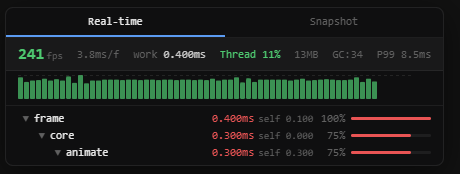

# Profiler



A deep runtime profiler built for real-time applications.
Originally made for a game engine but honestly works for anything that runs a frame loop in the browser.

The main idea — you describe your scope hierarchy with dot-separated paths like `"core.physics.collisions"` and the profiler automatically builds a call tree from that. No manual nesting, no boilerplate. One `beginScope`, multiple levels.

## How it works

```typescript
import { Profiler, beginScope, endScope } from './core/profiler/profiler';

function gameLoop() {
  Profiler.beginFrame();

  // this single call opens 3 levels: core → physics → collisions
  beginScope("core.physics.collisions");
  resolveCollisions();
  endScope();  // closes "collisions", now you're inside "physics"

  runPhysicsStep();
  endScope();  // closes "physics", now inside "core"

  doOtherStuff();
  endScope();  // closes "core"

  Profiler.endFrame();
  Profiler.updateOverlay();

  requestAnimationFrame(gameLoop);
}
```

Each `endScope()` pops one level from the stack (innermost first), and the time between scopes gets attributed to the right parent. So you get a proper tree with self-time, total time, percentages, the whole thing.

There's also a wrapper if you don't want to deal with manual begin/end:

```typescript
import { profile } from './core/profiler/profiler';

profile("core.render.shadows", () => {
  renderShadowMaps();
});
// async version exists too — profileAsync()
```

## The overlay

Press **F3** (configurable) and you get an in-game overlay with:

- **Real-time tab** — live FPS, frame time, thread utilization, memory, sparkline graph, and a collapsible scope tree
- **Snapshot tab** — record sessions, browse frame-by-frame with a slider, see aggregated summary across all recorded frames, export/import as compressed JSON

### Setting it up

```typescript
Profiler.createOverlay({
  position: 'top-right',   // top-left | top-right | bottom-left | bottom-right
  margin: 16,              // px from screen edge
  fontSize: 12,            // base font size
  opacity: 0.9,            // background opacity
  toggleKey: 'F2',         // any KeyboardEvent.key value
  startVisible: true,      // show without pressing the key first
  zIndex: 99999,
  minWidth: 420,
  maxWidth: 520,
  maxHeight: '85vh',
  container: document.body, // where to mount the DOM element
});
```

All fields are optional. Defaults are sane — `top-left`, `F3`, hidden until toggled.

## Recording & snapshots

```typescript
Profiler.startRecording();

// ...let it run for a while...

const session = Profiler.stopRecording();

// export to compressed JSON (short keys, trimmed precision)
const json = Profiler.exportRecording(session);

// download as file (happens automatically from the overlay UI too)

// import back
const loaded = Profiler.importRecording(jsonString);
```

The snapshot tab has two views:
- **Frames** — step through each captured frame, see the tree, navigate with arrow buttons or drag the slider
- **Summary** — total time per scope aggregated across the entire recording. Shows you where time actually went overall, not just one frame

## GC detection

The profiler tries to detect garbage collection pauses using heuristics since browsers don't expose GC timing directly. Two detection paths:

- **Idle spike** — if the gap between frames is way higher than the smoothed average and your work time was normal, something stalled the thread. Probably GC
- **Heap drop** — if `performance.memory.usedJSHeapSize` drops by 1MB+ between frames, the garbage collector definitely ran (works in Chrome)

When GC is detected the overlay shows a purple marker on the sparkline and a `GC ~Xms` label in the header. It's not 100% accurate (V8's concurrent GC can have sub-millisecond pauses that are basically invisible) but it catches the ones that actually matter for frame drops.

There's a 30-frame cooldown between detections to avoid spam from stale `performance.memory` updates.

## Querying from code

```typescript
Profiler.getFps()               // smoothed FPS
Profiler.getFrameDeltaMs()      // wall-clock ms between frames
Profiler.getWorkMs()            // actual work time this frame
Profiler.getCpuUtilization()    // work / frameDelta (it's really thread utilization not CPU)
Profiler.getAverageFrameMs(60)  // average over last N frames
Profiler.getP99FrameMs(300)     // P99 frame time
Profiler.getFrameHistory(60)    // Float32Array of recent frame times
Profiler.getScopeMs("physics")  // total ms for a specific scope this frame
Profiler.getScopeAvgMs("physics")
Profiler.getCallTree()          // full tree as flat array with depth info
Profiler.getHotScopes(5)        // top N scopes by self-time
Profiler.getMemoryUsage()       // { heapUsed, heapTotal, heapLimit } or null
Profiler.getTextReport()        // formatted text dump for console
Profiler.isGcSuspected()        // did GC happen this frame?
Profiler.getGcEstimatedMs()     // estimated GC pause
Profiler.getGcCount()           // total detected GC events
```

## Zero overhead when disabled

The flag `PROFILING_ENABLED` at the top of the file is a compile-time constant. When set to `false`, `beginScope`/`endScope` become empty functions that V8 will inline away. No branching, no overhead, no strings allocated.

## Internals if you care

- Pre-allocated node pool (512 nodes max) — no GC pressure from the profiler itself
- Scope stack is a typed `Int16Array(64)` 
- Frame history stored in ring buffers (`Float32Array`)
- Tree structure uses linked lists (parent/firstChild/nextSibling indices)
- Overlay updates throttled to 200ms intervals
- Snapshot DOM uses targeted updates instead of full rerenders so the slider actually works while dragging

## Stack

TypeScript, esbuild, No frameworks, no dependencies.
